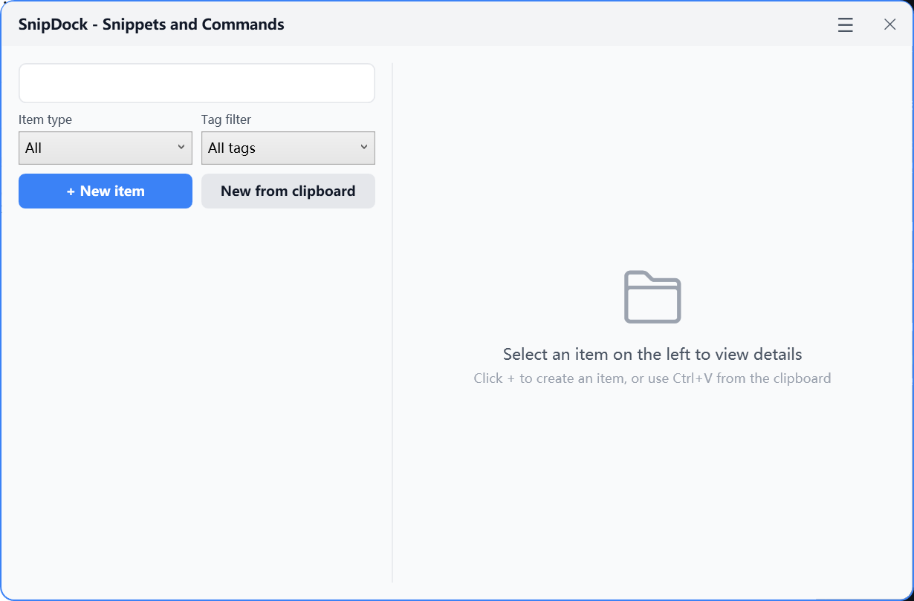
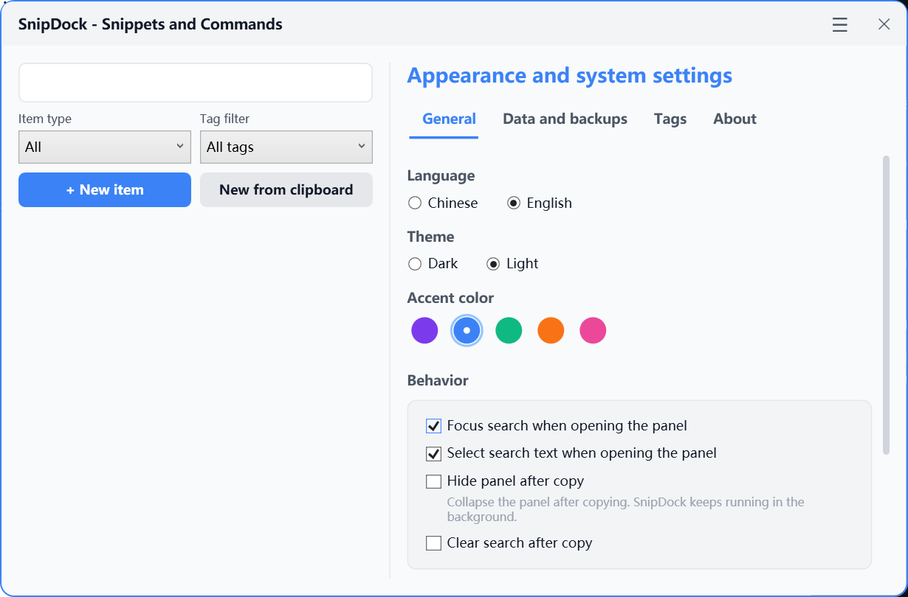

# SnipDock

SnipDock is a lightweight local Windows snippet manager for quickly saving, searching, and copying prompts, commands, code snippets, notes, and frequently used information.

Current release: **v0.2.0**. This release adds the first installer packaging workflow while keeping SnipDock local-first and lightweight.

Chinese README: [README.zh-CN.md](./README.zh-CN.md)

## Positioning

SnipDock is a **local-first** Windows desktop utility. It stores data in local files, does not upload user data to the cloud, and is not a command runner.

Command items are copy-only. SnipDock never automatically executes saved commands.

## Features

- Prompt / command / code snippet / note item types
- Search by title and tags
- Type filters and tag filters
- Favorites, pinned items, recent usage, and usage counts
- Global hotkey
- System tray
- Windows floating ball
- Light / Dark themes
- Multiple accent colors
- Create, edit, delete, and copy
- Non-blocking toast after copy
- Optional auto-hide after copy
- JSON import / export
- Automatic backups and backup restore
- Windows startup launch
- Local JSON safe writes

## Screenshots





## Download and Run

SnipDock provides two release formats:

- Installer: run `SnipDock-Setup-v0.2.0.exe` and follow the setup wizard.
- Zip / portable package: extract the package and run:

```text
SnipDock.App.exe
```

Current packages are framework-dependent. If the app does not start, install the .NET 9 Desktop Runtime first.

The installer installs SnipDock for the current user, creates a Start Menu shortcut, and can optionally create a desktop shortcut. Uninstalling SnipDock removes the installed app files, but does not delete the local data folder selected by the user.

## Run From Source

```powershell
dotnet run --project src/SnipDock.App/SnipDock.App.csproj
```

## Build

```powershell
dotnet build SnipDock.sln
```

## Test

```powershell
dotnet test SnipDock.sln
```

## Publish

```powershell
dotnet publish src/SnipDock.App/SnipDock.App.csproj -c Release -r win-x64 --self-contained false -o .\publish\SnipDock
```

The `publish/` folder is ignored by Git and should not be committed.

## Build Installer

SnipDock uses Inno Setup for the Windows installer. Install Inno Setup, create the Release publish output, then compile:

```powershell
ISCC.exe .\installer\SnipDock.iss
```

The installer output is written to `dist\installer\`, which is ignored by Git.

## Data Storage

On first launch, SnipDock asks the user to choose a local data directory. User items, settings, backups, and runtime logs are stored locally.

- Bootstrap config: `%APPDATA%\SnipDock\bootstrap.json`
- Bootstrap logs: `%LOCALAPPDATA%\SnipDock\logs\`
- User data: the directory selected by the user
- Main data file: `prompts.json`
- Safety backup: `prompts.json.bak`
- Automatic backups: `backups\`
- App logs: `logs\`
- Local settings: `settings.json`

## Privacy

- Data is stored locally
- No cloud upload
- No automatic command execution
- Command items are copied, not run
- Logs should not record item content or clipboard content

## Known Limitations

- Windows only
- No cloud sync
- Installer is available, but it does not bundle the .NET Desktop Runtime
- No automatic update yet; the About page opens GitHub Releases for manual update checks
- Search covers titles and tags only, not item content
- Command items are copy-only
- Beta release, more real-world stability testing is still needed

## FAQ

**Do I need to install .NET 9?**

The current package is framework-dependent, so Windows needs the .NET 9 Desktop Runtime unless it is already installed.

**Where is my data stored?**

SnipDock stores items in the local folder you choose on first launch. The main data file is `prompts.json`, with backups in `backups\`.

**How do I disable startup launch?**

Open SnipDock settings and turn off startup launch. The app uses the current user's `HKCU` startup entry, so administrator permission is not required.

**How do I back up or restore data?**

Use JSON export for manual archives, or restore from the automatic backup folder in settings. SnipDock creates a safety backup before restoring.

## Roadmap

- v0.2.0: installer and release experience
- v0.3.0: template variables
- v0.4.0: Markdown preview
- v0.5.0: batch management and duplicate detection

## License

SnipDock is licensed under the [MIT License](./LICENSE).
