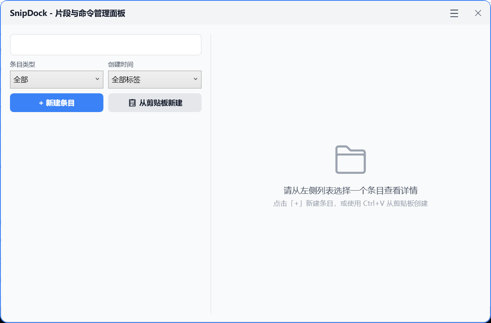
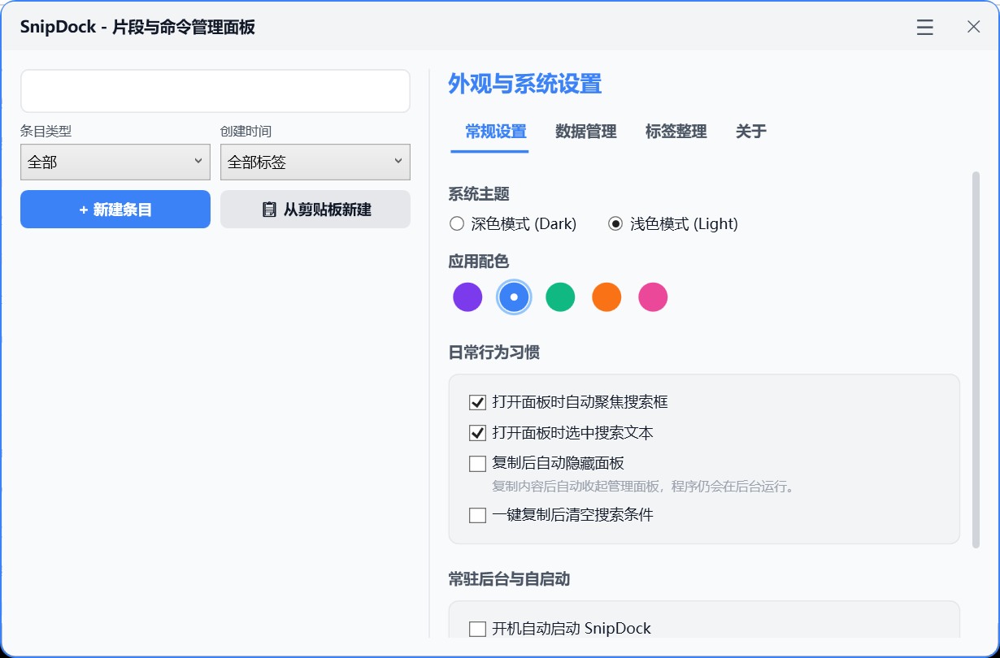

# SnipDock

SnipDock 是一个 Windows 本地轻量片段管理器，用于快速保存、搜索和复制 Prompt、命令、代码片段、笔记和常用信息。

当前版本：**v0.1.0-beta**。这是 SnipDock 的首个 beta 版本，适合早期试用和反馈。

## 项目定位

SnipDock 是一个 **local-first** 的本地优先工具。它不提供云同步，不把用户条目上传到云端，也不是命令执行器。

命令类条目只用于复制到剪贴板，SnipDock 不会自动运行或执行保存的命令。

## 功能特性

- Prompt / 命令 / 代码片段 / 笔记多类型条目
- 标题和标签搜索，不搜索正文内容
- 类型筛选、标签筛选
- 收藏、置顶、最近使用和使用次数
- 全局快捷键
- 系统托盘
- Windows 悬浮球
- Light / Dark 主题
- 多 Accent 配色
- 新建、编辑、删除、复制
- 复制后非阻塞 Toast 提示
- 可选复制后自动隐藏管理面板
- 导入 / 导出 JSON
- 自动备份和备份恢复
- 开机自启
- 本地 JSON 安全写入
- 从旧 PromptShelf 配置兼容迁移

## 截图

截图文件会后续补充到 `docs/images/` 目录。





## 下载和运行

如果你下载的是已发布的 exe 包，可以直接运行：

```text
SnipDock.App.exe
```

当前发布命令使用 framework-dependent 方式打包。如果运行环境没有安装 .NET 9 Runtime，请先安装 .NET 9 Desktop Runtime。

## 从源码运行

```powershell
dotnet run --project src/SnipDock.App/SnipDock.App.csproj
```

## 构建

```powershell
dotnet build SnipDock.sln
```

## 测试

```powershell
dotnet test SnipDock.sln
```

## 发布

```powershell
dotnet publish src/SnipDock.App/SnipDock.App.csproj -c Release -r win-x64 --self-contained false -o .\publish\SnipDock
```

发布产物目录 `publish/` 已加入 `.gitignore`，不应提交到仓库。

## 数据存储位置

SnipDock 首次启动时会引导用户选择一个本地数据目录。用户条目、设置、备份和正式日志都会保存在用户选择的位置。

- 引导配置：`%APPDATA%\SnipDock\bootstrap.json`
- 启动日志：`%LOCALAPPDATA%\SnipDock\logs\`
- 用户数据：用户选择的数据目录
- 主数据文件：`prompts.json`
- 安全备份：`prompts.json.bak`
- 自动备份目录：`backups\`
- 正式日志目录：`logs\`
- 本地设置文件：`settings.json`

请不要把自己的数据目录提交到 Git 仓库。

## 从 PromptShelf 迁移

SnipDock 曾用名为 PromptShelf。为了保护已有用户数据，SnipDock 保留了旧配置兼容迁移逻辑：

- 会兼容旧 `%APPDATA%\PromptShelf\bootstrap.json`
- 如果新配置不存在，会迁移到 `%APPDATA%\SnipDock\bootstrap.json`
- 不删除旧 PromptShelf 配置
- 不移动用户已选择的数据目录
- `prompts.json` 文件名暂时保留，以保证兼容

## 隐私说明

- 数据只保存在本地
- 不上传云端
- 不自动执行命令
- 命令条目只复制，不运行
- 日志不应记录条目正文和剪贴板内容

## 已知限制

- 仅支持 Windows
- 暂不提供云同步
- 暂不提供安装器和自动更新
- 搜索范围仅包括标题和标签，不包括条目正文
- 命令条目不会执行，只会复制
- beta 阶段仍需要更多真实环境稳定性验证

## Roadmap

- 补充正式截图和演示说明
- 完善 GitHub Release 附件和校验信息
- 准备更友好的安装包
- 持续验证备份恢复、导入导出、开机自启和存储目录切换
- 继续整理中文文案和公开文档

## License

SnipDock 使用 [MIT License](./LICENSE)。
