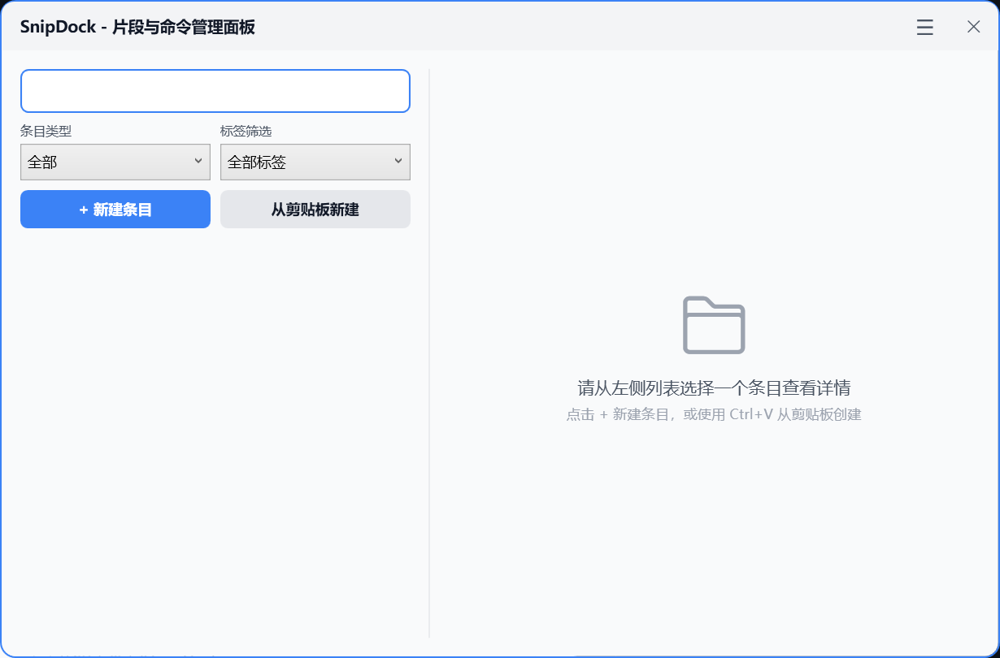
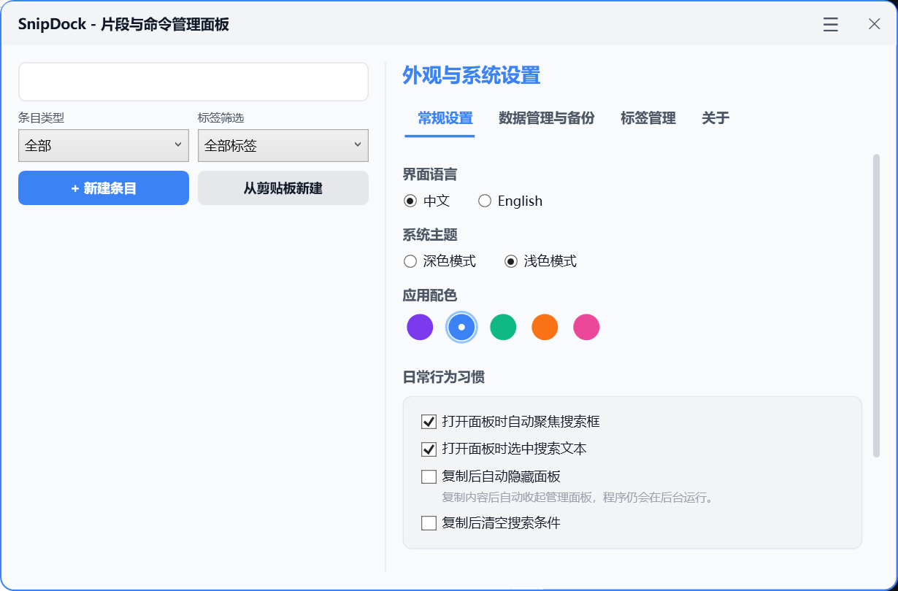

# SnipDock

SnipDock 是一个 Windows 本地轻量片段管理器，用于快速保存、搜索和复制 Prompt、命令、代码片段、笔记和常用信息。

当前版本：**v0.5.0**。这个版本加入批量管理与重复检测，同时继续保持本地优先和轻量定位。

English README: [README.md](./README.md)

## 项目定位

SnipDock 是一个 **local-first** 的本地优先 Windows 桌面工具。它将数据保存到本地文件，不上传云端，也不是命令执行器。

命令类条目只用于复制到剪贴板，SnipDock 不会自动运行或执行保存的命令。

## 功能特性

- Prompt / 命令 / 代码片段 / 笔记多类型条目
- 标题和标签搜索，不搜索正文内容
- 类型筛选、标签筛选
- 收藏、置顶、最近使用和使用次数
- 全局快捷键
- 系统托盘
- Windows 悬浮球
- Light / Dark 主题
- 多 Accent 配色
- 新建、编辑、删除、复制
- 复制后非阻塞 Toast 提示
- 可选复制后自动隐藏管理面板
- 导入 / 导出 JSON
- 自动备份和备份恢复
- 开机自启
- 本地 JSON 安全写入
- 模板变量，例如 `{{name}}`、`{{content}}`、`{{style}}`
- Markdown 预览，用于阅读 Prompt、代码片段和笔记
- 多选批量管理、批量加标签 / 改类型，以及重复检测

## 截图





## 下载和运行

SnipDock 提供两种发布形式：

- 安装包：运行 `SnipDock-Setup-v0.5.0.exe`，按照安装向导完成安装。
- Zip / 便携包：解压后直接运行：

```text
SnipDock.App.exe
```

当前发布包使用 framework-dependent 方式打包。如果运行环境没有安装 .NET 9 Runtime，请先安装 .NET 9 Desktop Runtime。

安装包会为当前用户安装 SnipDock，创建开始菜单快捷方式，并可选创建桌面快捷方式。卸载 SnipDock 只会移除安装目录中的程序文件，不会删除用户选择的数据目录。

## 从源码运行

```powershell
dotnet run --project src/SnipDock.App/SnipDock.App.csproj
```

## 构建

```powershell
dotnet build SnipDock.sln
```

## 测试

```powershell
dotnet test SnipDock.sln
```

## 发布

```powershell
dotnet publish src/SnipDock.App/SnipDock.App.csproj -c Release -r win-x64 --self-contained false -o .\publish\SnipDock
```

发布产物目录 `publish/` 已加入 `.gitignore`，不应提交到仓库。

## 构建安装包

SnipDock 使用 Inno Setup 生成 Windows 安装包。安装 Inno Setup 后，先生成 Release publish 产物，再执行：

```powershell
ISCC.exe .\installer\SnipDock.iss
```

安装包会输出到 `dist\installer\`，该目录已加入 `.gitignore`，不应提交到仓库。

## 数据存储位置

SnipDock 首次启动时会引导用户选择一个本地数据目录。用户条目、设置、备份和正式日志都会保存到用户选择的位置。

- 引导配置：`%APPDATA%\SnipDock\bootstrap.json`
- 启动日志：`%LOCALAPPDATA%\SnipDock\logs\`
- 用户数据：用户选择的数据目录
- 主数据文件：`prompts.json`
- 安全备份：`prompts.json.bak`
- 自动备份目录：`backups\`
- 正式日志目录：`logs\`
- 本地设置文件：`settings.json`

## 隐私说明

- 数据只保存在本地
- 不上传云端
- 不自动执行命令
- 命令条目只复制，不运行
- 日志不应记录条目正文和剪贴板内容

## 已知限制

- 仅支持 Windows
- 暂不提供云同步
- 已提供安装包脚本，但安装包暂不内置 .NET Desktop Runtime
- 暂不提供自动更新；关于页面会打开 GitHub Releases 供用户手动检查更新
- 搜索范围仅包括标题和标签，不包括条目正文
- 命令条目不会执行，只会复制
- beta 阶段仍需要更多真实环境稳定性验证

## FAQ

**需要安装 .NET 9 吗？**

当前发布包是 framework-dependent 形式。如果系统没有安装运行环境，需要先安装 .NET 9 Desktop Runtime。

**数据保存在哪里？**

SnipDock 会把条目保存到首次启动时选择的本地目录。主数据文件是 `prompts.json`，自动备份位于 `backups\`。

**如何关闭开机自启？**

在 SnipDock 设置中关闭开机自启即可。自启项使用当前用户的 `HKCU` 注册表位置，不需要管理员权限。

**如何备份和恢复？**

可以使用 JSON 导出做手动归档，也可以在设置中从自动备份目录恢复。恢复前 SnipDock 会先创建一份安全备份。

## Roadmap

- v0.5.0：批量管理与重复检测

## License

SnipDock 使用 [MIT License](./LICENSE)。
